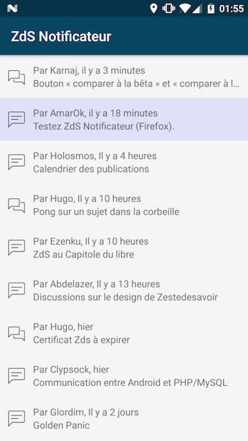
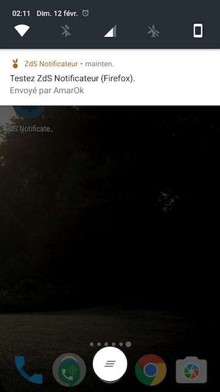

ZdS Notificateur
================

Projet Android destiné à notifier les utilisateurs Zeste de Savoir de toutes leurs nouvelles
notifications et de les consulter en ouvrant le navigateur web sur leurs téléphones.

Bientôt disponible sur le Google Play Store !

Comment exécuter le projet ?
----------------------------

Ce projet propose 3 environnements :

- `release` : Génère un APK pour dialoguer avec la prod de Zeste de Savoir.
- `beta` : Génère un APK pour dialoguer avec la beta de Zeste de Savoir.
- `debug` : Génère un APK pour dialoguer avec une instance locale de Zeste de Savoir.

Attention : Si vous voulez générer l'APK de release, il vous faudra créer votre propre keystore.

Captures
--------

 

License
-------

    Copyright 2017 Gérard Paligot

    Licensed under the Apache License, Version 2.0 (the "License");
    you may not use this file except in compliance with the License.
    You may obtain a copy of the License at

       http://www.apache.org/licenses/LICENSE-2.0

    Unless required by applicable law or agreed to in writing, software
    distributed under the License is distributed on an "AS IS" BASIS,
    WITHOUT WARRANTIES OR CONDITIONS OF ANY KIND, either express or implied.
    See the License for the specific language governing permissions and
    limitations under the License.