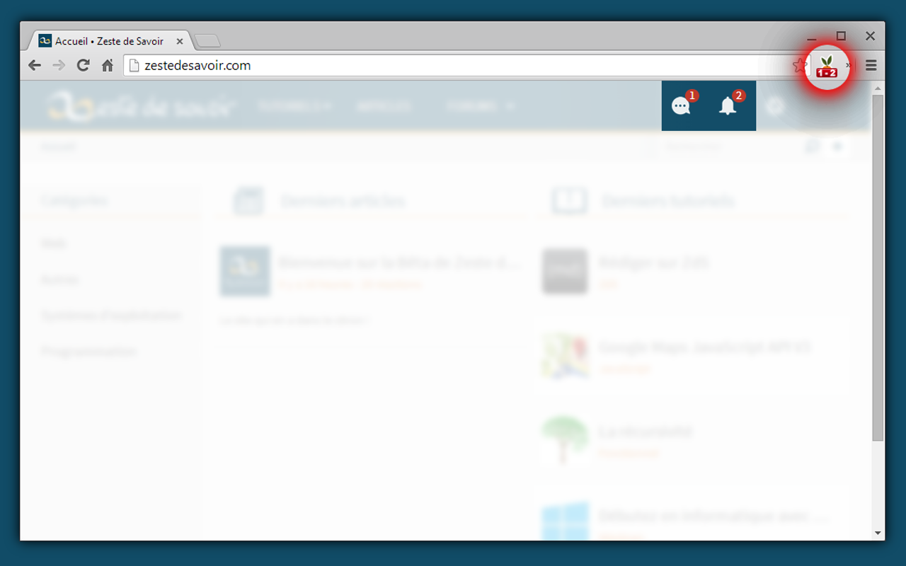
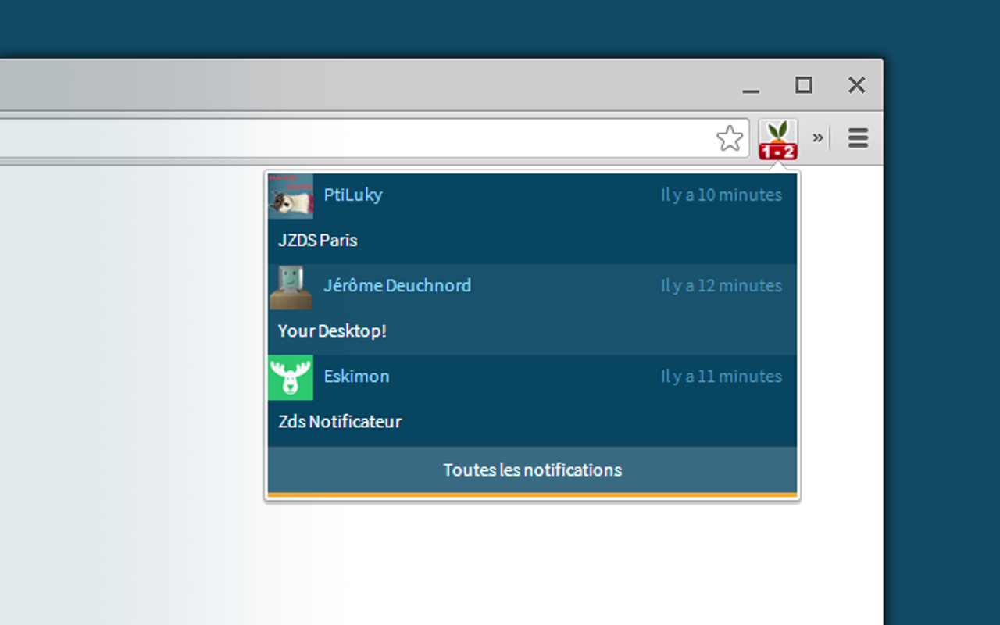
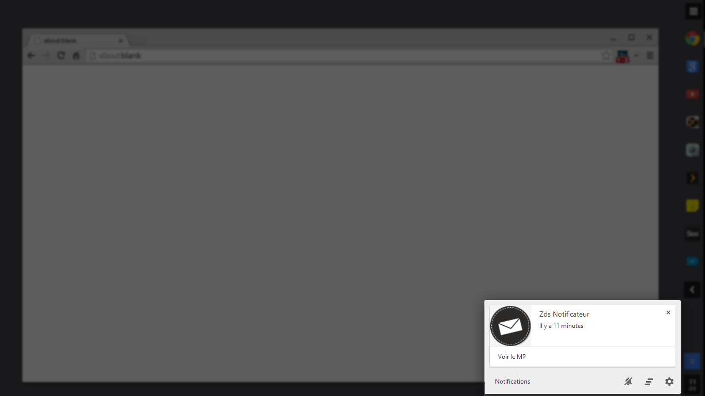
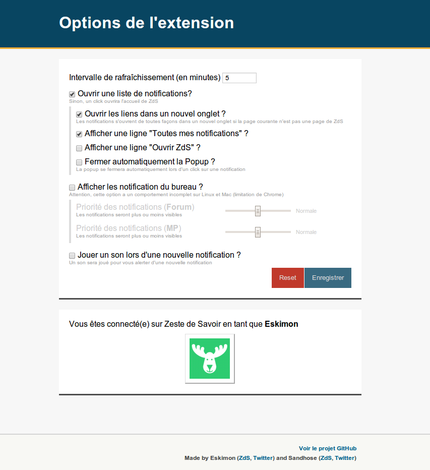
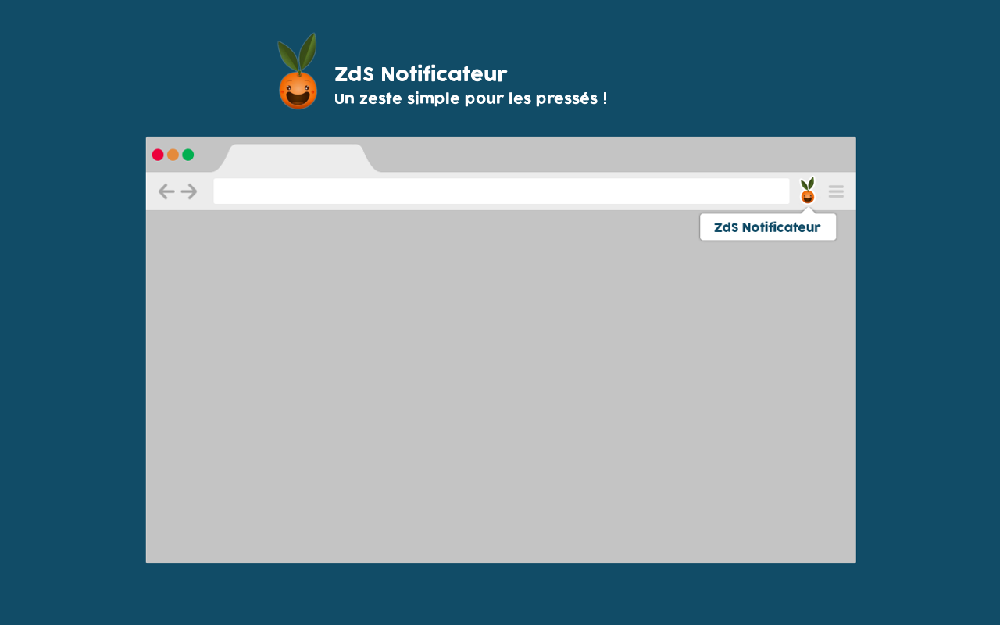

ZdS_Notificateur
================

 1. [Keskecé ?](#keskec%C3%A9-)
 2. [A quoi ça ressemble ?](#a-quoi-%C3%A7a-ressemble-)
 3. [J'peux vous aider ?](#jpeux-vous-aider-)
 4. [C'est qui qu'a fait ça ?](#cest-qui-qua-fait-%C3%A7a-)
 5. [Licence](license)

## Keskecé ?

C'est une extension pour Google Chrome, qui vous averti des nouvelles notifications sur [Zeste de Savoir](http://zestedesavoir.com).
Elle récupère à interval régulier (réglable) vos dernières notifications, et vous les affichent directement.

L'extension est disponible sur le [Chrome WebStore](https://chrome.google.com/webstore/detail/zds-notificateur/jibjnbbmokappnjpdodmpdmpklfhokkn)

## A quoi ça ressemble ?

*L'icone dans la barre d'addresse, et une popup avec la liste des notifications*

*Une notification de bureau*

*La page des options*

## J'peux vous aider ?

Toute aide est la bienvenue! Pour cela, faites un fork du repo, et une fois que vous avez rajouté ce que vous voulez, on prenderas en compte tout *Pull request* ;)

### Google Chrome

Pour tester l'extension depuis les sources, téléchargez les sources [ici](https://github.com/zestedesavoir/extensions-notificateurs/archive/master.zip), et glissez/déposez le dossier "Google Chrome" du zip dans la page [chrome://extensions](chrome://extension) (nécessite d'avoir activé le *mode développeur* )

### Firefox

Pour tester l'extension depuis les sources, téléchargez les sources [ici](https://github.com/zestedesavoir/extensions-notificateurs/archive/master.zip) et rendez vous dans le dossier Firefox/test. Enfin, glissez-déposez le fichier .xpi dans la page [about:addons](about:addons).

## C'est qui qu'a fait ça ?

Eskimon, est à l'origine de l'idée et Sandhose, horifié par le code, mais séduit par l'idée, l'a rejoint par après.
(Pour sa défense, Eskimon déclare avoir fait cette extension pour justement apprendre le javascript. Il remercie Sandhose de sa patience :D )

Piwit est ensuite venu apporter sa touche graphique pour proposer les différentes illustrations inspirés des graphismes originaux de Zeste De Savoir.

AmarOk a commencé à porter l'extension sur Firefox (en cours de création). Mais n'étant pas développeur Web, le code horrifiera d'autres personnes.

## License

The MIT License (MIT)

Copyright (c) 2013 Eskimon

Permission is hereby granted, free of charge, to any person obtaining a copy of
this software and associated documentation files (the "Software"), to deal in
the Software without restriction, including without limitation the rights to
use, copy, modify, merge, publish, distribute, sublicense, and/or sell copies of
the Software, and to permit persons to whom the Software is furnished to do so,
subject to the following conditions:

The above copyright notice and this permission notice shall be included in all
copies or substantial portions of the Software.

THE SOFTWARE IS PROVIDED "AS IS", WITHOUT WARRANTY OF ANY KIND, EXPRESS OR
IMPLIED, INCLUDING BUT NOT LIMITED TO THE WARRANTIES OF MERCHANTABILITY, FITNESS
FOR A PARTICULAR PURPOSE AND NONINFRINGEMENT. IN NO EVENT SHALL THE AUTHORS OR
COPYRIGHT HOLDERS BE LIABLE FOR ANY CLAIM, DAMAGES OR OTHER LIABILITY, WHETHER
IN AN ACTION OF CONTRACT, TORT OR OTHERWISE, ARISING FROM, OUT OF OR IN
CONNECTION WITH THE SOFTWARE OR THE USE OR OTHER DEALINGS IN THE SOFTWARE.

------

